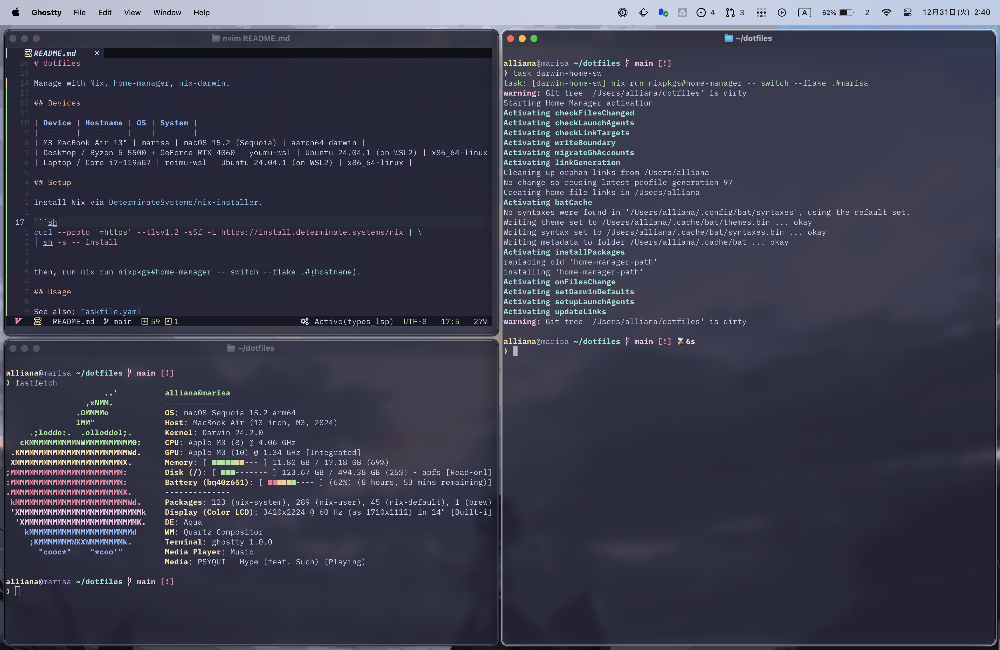

# dotfiles

Manage with [Nix](https://nixos.org), [home-manager](https://github.com/nix-community/home-manager), [nix-darwin](https://github.com/LnL7/nix-darwin).



## Devices

| Device | Hostname | OS | System |
|  --    |   --     | -- |  --    |
| M3 MacBook Air 13" | marisa | macOS 15.2 (Sequoia) | aarch64-darwin |
| Desktop / Ryzen 5 5500 + GeForce RTX 4060 | youmu-wsl | Ubuntu 24.04.1 (on WSL2) | x86_64-linux |
| Laptop / Core i7-1195G7 | reimu-wsl | Ubuntu 24.04.1 (on WSL2) | x86_64-linux |

## Setup

Install Nix via [DeterminateSystems/nix-installer](https://github.com/DeterminateSystems/nix-installer).

```sh
curl --proto '=https' --tlsv1.2 -sSf -L https://install.determinate.systems/nix | \
  sh -s -- install
```

then, run `nix run nixpkgs#home-manager -- switch --flake .#{hostname}`.

## Usage

See also: [Taskfile.yaml](https://github.com/Allianaab2m/dotfiles/blob/main/Taskfile.yaml)

### Update

```sh
task up
```

### Garbage collection

```sh
task gc
```

### home-manager switch

> [!NOTE]
> It works only Linux devices.

```sh
task hmsw
```

### nix-darwin switch

> [!NOTE]
> It works only macOS(darwin) devices.

```sh
task darwin-sw
```

### home-manager switch (for darwin)

```sh
task darwin-home-sw
```
